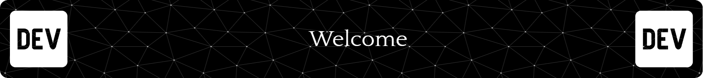

# About Me

I'm **Jani Patrik**, a **Full-Stack** developer specializing in **Vue.js and React** on the frontend, and **NestJS and Express** on the backend. I've worked on numerous projects, which you can explore in my **organization (Valid-Hub)** linked below. Feel free to reach out via **email or Discord**—my contact details are provided! 

# Technologies
**Frontend**
- 🌐 Languages: JavaScript (ES6+), TypeScript, HTML5, CSS3, SASS
- ⚡ Frameworks & Libraries: Vue.js, React, Tailwind CSS, Bootstrap, Vuetify

**Backend**
- 🛠 Languages: JavaScript, TypeScript, C#
- 🔥 Frameworks & Tools: NestJS, Express.js, .NET Framework
- 🗄 Databases: MySQL, PostgreSQL

**Other Tools & Technologies**
- 🎛 Version Control: Git, GitHub
- 🐳 DevOps & Deployment: Docker, Portainer, Cloudflare
- 🔍 Testing: NUnit, Jest

## Contant & Links

**Contact**
- ✉️ Email: janipatrik138@gmail.com
- 🎮 Discord: valid

**Links**
- 🌐 Website: [Portfolio](https://example.com)
- 🏢 Github Organization: [Valid-Hub](https://github.com/Valid-Hub)
